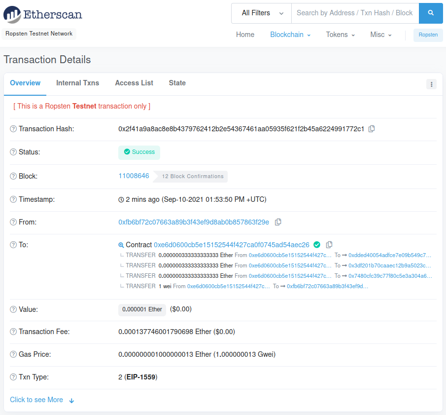
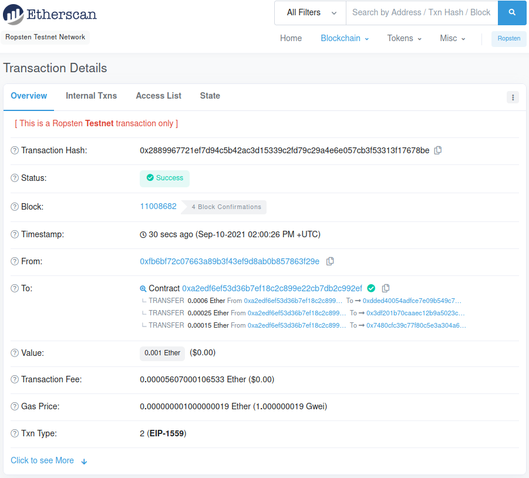
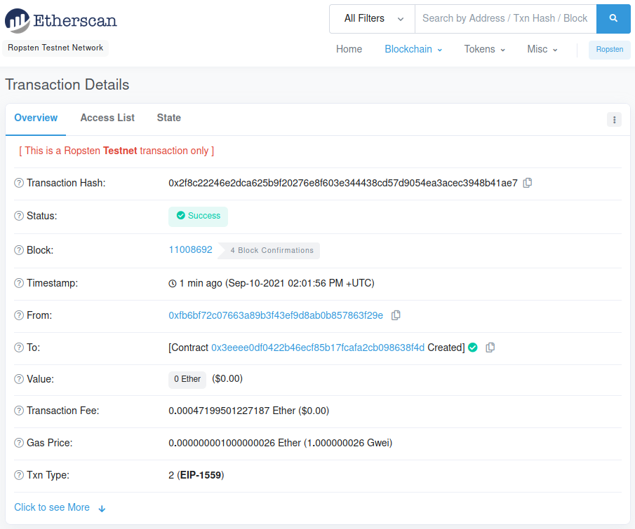

# Smart Contracts in Solidity

## Background

Smart Contracts can be used to simplify payroll actions. This repo includes 3 examples of how you could implement them, all deployed on the Ropsten test network.

## Contracts

* [Split deposit 3 ways](Code/even_split.sol)

This contract takes a deposit and splits it equally to three recipient accounts.

[Interact here](https://ropsten.etherscan.io/address/0xE6D0600CB5E15152544f427Ca0f0745aD54aeC26)

* [Split deposit: weighted](Code/tiered_split.sol)

This contract takes a deposit and splits it into 3 different accounts based on weighted values.

[Interact here](https://ropsten.etherscan.io/address/0xa2EdF6ef53D36b7ef18C2c899e22CB7db2c992ef)

* [Deferred share distribution](Code/deferred.sol)

This contract distributes shares to a recipient once a year for 4 years, returning remaining balance to origin if the contract is deactivated.

[Interact here](https://ropsten.etherscan.io/address/0x3eeee0df0422b46ecf85b17fcafa2cb098638f4d)
